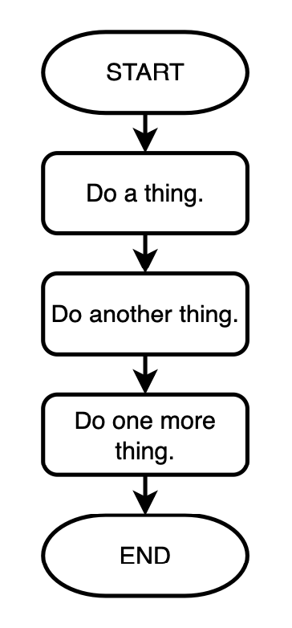
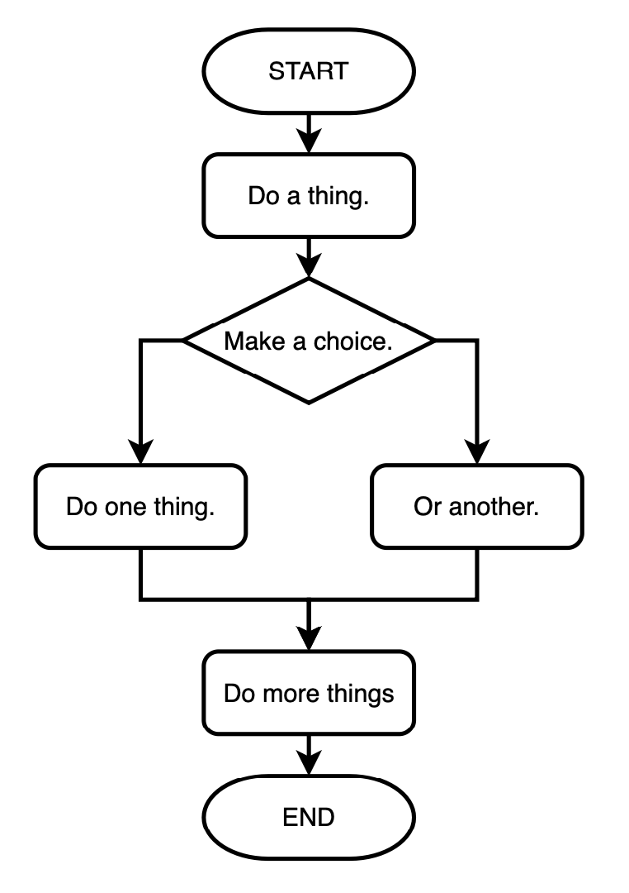

# Summary of Unit 2: Control Flow
This is a summary of the topics covered in Unit 2: Control Flow. 

## Booleans
A boolean is a value that can either be true or false. Booleans are a new data type, adding to your existing knowledge of integers, floats, and strings in Python. 

For example, here are two boolean variables:

```python
has_passport = True
has_drivers_license = False
```

Note the following about the above variable declaration:
- Booleans are special values that must begin with a capital letter, e.g. `True` and `False`.
- Booleans do not use quotes. 

## If Statements
Thus far, we have been writing sequential programs. These are programs that run linearly, step-by-step, from start to finish. A sequential program might look something like this:



Programs often need to do different things based on circumstances. This leads us to a programming concept known as **selection**, which might look something like this: 



# Control Flow in Python

## If / Elif / Else Statements

In Python, the `if`, `elif`, and `else` statements are used for decision-making in your code. These statements allow you to execute certain blocks of code based on whether certain conditions are true or false.

```python
if condition1:
    # Code block to execute if condition1 is True
elif condition2:
    # Code block to execute if condition1 is False and condition2 is True
else:
    # Code block to execute if both condition1 and condition2 are False
```

It's crucial to pay attention to the indentation in Python. Indentation determines which lines of code belong to which block. Incorrect indentation can lead to syntax errors or unintended behavior.

## Comparison Operators

Comparison operators are used to compare values. They return either True or False depending on the comparison result. These operators are often used within if statements to evaluate conditions.

- `==`: Equal to
- `!=`: Not equal to
- `<`: Less than
- `>`: Greater than
- `<=`: Less than or equal to
- `>=`: Greater than or equal to

Example:

```python
x = 5
y = 10

if x < y:
    print("x is less than y")
else:
    print("x is greater than or equal to y")
```

Remember to use these operators wisely to create meaningful conditions in your programs.

## Logical Operators

Logical operators are used to combine conditional statements. They allow you to create more complex conditions by combining simpler conditions.

- `and`: Returns True if both conditions are True
- `or`: Returns True if at least one condition is True
- `not`: Returns True if the condition is False, and vice versa

Example:

```python
x = 5
y = 10

if x > 0 and y > 0:
    print("Both x and y are positive numbers")
elif x > 0 or y > 0:
    print
