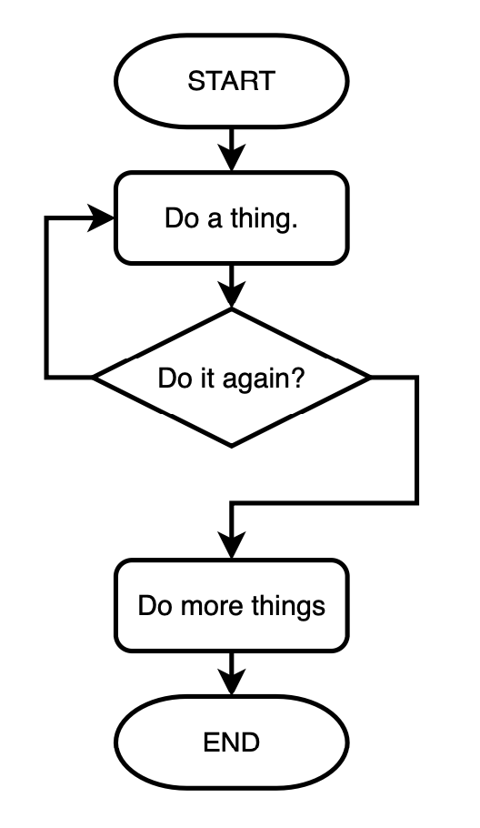
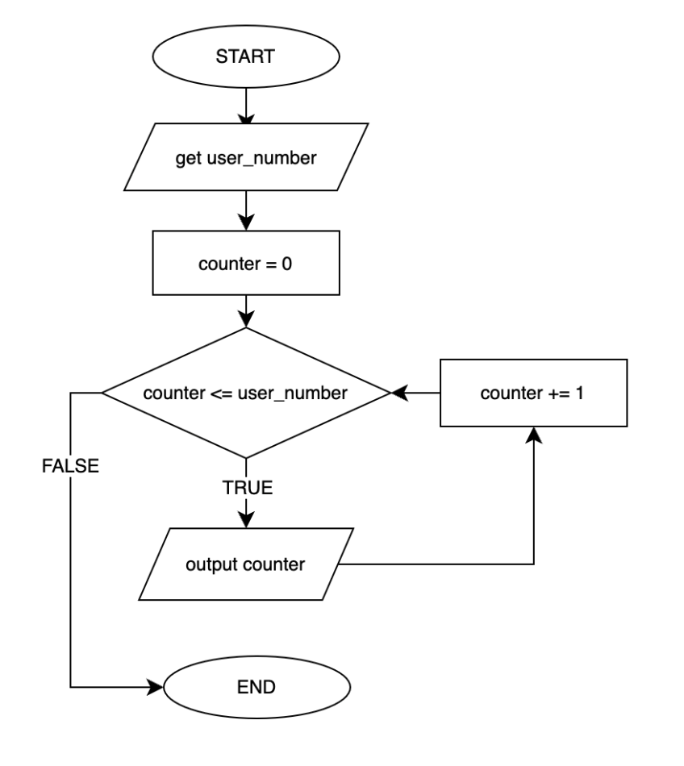

# Summary of Unit 2: Control Flow
This is a summary of the topics covered in Unit 2: Control Flow. 

## Booleans
A boolean is a value that can either be true or false. Booleans are a new data type, adding to your existing knowledge of integers, floats, and strings in Python. 

For example, here are two boolean variables:

```python
has_passport = True
has_drivers_license = False
```

Note the following about the above variable declaration:
- Booleans are special values that must begin with a capital letter, e.g. `True` and `False`.
- Booleans do not use quotes. 

<br><br>

## `if` / `elif` / `else` Statements
Thus far, we have been writing sequential programs. These are programs that run linearly, step-by-step, from start to finish. A sequential program might look something like this:


Programs often need to do different things based on circumstances. This leads us to a programming concept known as **selection**, which might look something like this: 


In Python, the `if`, `elif`, and `else` statements are used for decision-making in your code. These statements allow you to execute certain blocks of code based on whether certain conditions are true or false.

When evaluating a single condition, you might use:

```python
if condition_is_true:
    # Code block to execute if condition is True
else:
    # Code block to execute if condition is False
```

If there are more conditions to evaluate, you can add use `elif` (often pronounced as "*else if*")to test these conditions:


```python
if condition1_is_true:
    # Code block to execute if condition1 is True
elif condition2_is_true:
    # Code block to execute if condition1 is False, but condition2 is True
else:
    # Code block to execute if both condition1 and condition2 are False
```

Note the use of **indentation** in the code blocks above. It's crucial to pay attention to the indentation in Python. Indentation determines which lines of code belong to which block. Incorrect indentation can lead to syntax errors or unintended behavior.

<br><br>

## Comparison Operators

Comparison operators are used to compare values. They return a boolean value — either `True` or `False` — depending on the comparison result. These operators are often used within if statements to evaluate conditions.

Operator | Definition
---|---
`==` | Equal to
`!=` | Not equal to
`<` | Less than
`>` | Greater than
`<=` | Less than or equal to
`>=` | Greater than or equal to

Note the use of `==` as a comparison operator for *equality*. There is an important distinction from the single `=` symbol used in variable assignment. They are **not interchangeable**.

Example:

```python
x = 5
y = 10

if x < y:
    print("x is less than y")
else:
    print("x is greater than or equal to y")
```

You can use variables or explicitly defined values around these comparison operators. For example:

```python
target_score = 15
user_score = 19

if user_score > target_score:
    print("Congratultions! You did it!")
else:
    print("Sorry, try again.")
```

The above program would function exactly the same as:

```python
user_score = 19

if user_score > 15:
    print("Congratultions! You did it!")
else:
    print("Sorry, try again.")
```

<br><br>

## Logical Operators

Logical operators are used to combine multiple conditional statements. They allow you to create more complex conditions by combining simpler conditions.

Operator | Definition
---|---
`and` | Returns `True` if both conditions are `True`
`or` | Returns `True` if at least one condition is `True`
`not` | Returns `True` if the condition is `False`, and vice versa

Example:

```python
has_passport = True
has_visa = False

if has_passport and has_visa:
    print("You may enter the country.")
elif has_passport and not has_visa:
    print("You need a visa to enter the country.")
elif has_visa and not has_passport:
    print("You need a passport to enter the country.")
else:
    print("You need a passport and visa to enter the country.")
```

### Order of Operations
You can combine logical operators with parentheses to force certain conditions to evaluate first. For example:

```python
customer_age = 67
has_membership = True

if (customer_age <= 18 or customer_age >= 65) and has_membership:
    print("Discount applies.")
else:
    print("No discount.")
```

The above code will evaluate the `customer_age` first with the logical `or` operator. The result is then evaluated with the next `and` expression.

<br><br>

## Style with Conditionals
There are a few notes for good programming style when using conditionals:

- Leave whitespace around conditional operators, as you would arithmetic operators.
- Use logical paragraphs and keep code blocks together their respective conditions.
- Use parentheses to clarify and group conditionals when using logical operators.

### Example: Whitespace around operators
#### Good
```python
if user_score > 15:
    print("Congratultions! You did it!")
```

#### Bad
```python
if user_score>15:
    print("Congratultions! You did it!")
```

### Example: Use logical paragraphs
#### Good
```python
if has_passport and has_visa:
    print("You may enter the country.")
elif has_passport and not has_visa:
    print("You need a visa to enter the country.")
elif has_visa and not has_passport:
    print("You need a passport to enter the country.")
else:
    print("You need a passport and visa to enter the country.")
```

#### Bad
```python
if has_passport and has_visa:


    print("You may enter the country.")
elif has_passport and not has_visa:
    print("You need a visa to enter the country.")

elif has_visa and not has_passport:
    print("You need a passport to enter the country.")
else:
    print("You need a passport and visa to enter the country.")
```

### Example: Use parentheses for grouping and clarification
#### Good
```python
if (user_age < 12 or user_age >= 65) and (has_id == "y" or has_id == "Y"):
    print("Yes! You are eligible for a discount!")
else:  
    print("Sorry, no discount.")
```

<br><br>

## `While` Loop
Programs often need to run a block of code repeatedly. This is done with a loop. In a flow chart, it looks something like this: 



One of the main loop constructs is called a `while` loop, which repeatedly executes a block of code as long as a specified condition is true. 

Here's the basic syntax of the `while` loop:
```python
while condition:
    # code block to be executed
```

The condition is a boolean expression (see Comparison Operators section, above) that determines whether the loop should continue or stop. The code block under the while statement is executed repeatedly until the condition becomes `False`.

### Example
This code:

```python
num = 1
while num <= 5:
    print(num)
    num += 1
```

would result in the output:

```
1
2
3
4
5
```
The loop prints numbers from 1 to 5 because the condition `num <= 5` is true for those values of num.

<br><br>

## `For` Loop
A `for` loop in Python **iterates** over a sequence and executes a block of code for each item in the sequence. Here's the basic syntax:
```python
for item in sequence:
    # code block to be executed
```

`item` is a variable that represents the current item in the sequence being processed. `sequence` is any iterable object that contains multiple items. For our examples we used the `range()` function to give us a sequence o numbers.

## Using the `range()` Function
The `range()` function in Python generates a sequence of numbers based on the parameters provided. It's commonly used with for loops to execute a block of code a specific number of times.

Here's how the `range()` function works:

```python
range(start, stop, step)
```

* `start` (optional): The starting value of the sequence. If not provided, it defaults to 0.
* `stop`: The end value of the sequence. The sequence will stop before reaching this value.
* `step` (optional): The step size between each number in the sequence. If not provided, it defaults to 1.

### Generation of Sequence
When you call `range(start, stop, step)`, it generates a sequence of integers starting from `start` (inclusive) up to, but not including, `stop`. The numbers in the sequence are incremented by step.

#### Examples
* If you call `range(5)`, it generates a sequence from `0` to `4`.
* If you call `range(1, 6)`, it generates a sequence from `1` to `5`.
* If you call `range(1, 10, 2)`, it generates a sequence of odd numbers from `1` to `9`, i.e. `1`, `3`, `5`, `7`, `9`.

### Usage with `for` Loops
The `range()` function is commonly used with `for` loops to iterate a specific number of times. For example:
```python
for i in range(5):
    print(i)
```

This will print numbers from `0` to `4`, as the `range(5)` generates a sequence starting from `0` and ending before `5`.

<br><br>

## Looping with`for` versus `while`
Consider these two identical programs to draw a row of circles:

```python
# Initialize x_coodinate to 50
x_pos = 50

while x_pos <= 200:
    pygame.draw.circle(screen, BLACK, (x_pos, 100), 20)
    x_pos += 40  # Increment x_coordinate by 40
```

And using `for` with the `range()` function:

```python
for x_pos in range(50, 201, 40):
    pygame.draw.circle(screen, BLACK, (x_pos, 100), 20)
```

Hopefully, you can see how much easier it is to read the code using `for` and `range()`. The parameters for `x_pos` are all listed on the same line:
- `x_pos` starts at `50`
- `x_pos` stops at `201` (NOTE: Remember, `range` is not inclusive, so if we want `200` to be the final value, we need to specify a number greater than `200`.)
- `x_pos` increases or steps by `40` on each iteration

If you are using `while` loops in your implementation, consider replacing them with `for` and `range()` functions for cleaner code.

<br><br>

## Flowcharts & Tracing Tables
See the complete notes on flowcharts and tracing tables in [this document](https://docs.google.com/document/d/1d5BhTlQF2gZgkSgp5qZN4gHF4DGVArnCJrQTdPBmoOk).

### Algorithm vs. Program
An *algorithm* is a step-by-step procedure to solve a particular problem. It's similar to a recipe that outlines a logical sequence of actions. We often represent algorithms using flowcharts and pseudocode (i.e. human-readable code that isn't specific to any programming language).

A *program* is the concrete implementation of an algorithm in a specific programming language. It translate the abstract steps outlined in flowcharts into source code that a computer can understand and execute. In addition to the algorithmic logic, a program requires additional considerations like data structures, input/output handling, etc.

### Flowcharts
A *flowchart* is a picture of an algorithm. That is, it is a visual representation of the step-by-step order to solve a problem. In programming, we use flowcharts to visualize the order of the instructions in a program and the various directions that are taken to solve a problem or complete its task.

Familiarize yourself with the flowchart symbols in [this document](https://docs.google.com/document/d/1d5BhTlQF2gZgkSgp5qZN4gHF4DGVArnCJrQTdPBmoOk).

### Tracing Tables
Tracing tables are used to verify a solution by stepping through code and tracking the variable values and output. They are especially useful in programs with control structures and loops. 

A tracing table often shows the value of variables at each *iteration *or instance of the loop.

### Example: Flowchart & Tracing Table
For example, consider this program that counts up to a number:

```python
user_number = int(input("Enter a number: "))
counter = 0

while counter <= user_number:
   print(counter)
   counter += 1
```

The program's flowchart would look like:

<p></p>

The tracing table would look like:

user_number | counter | counter <= user_number | output
--|--|--|--
5 | 0 | True | `0`
&nbsp; | 1 | True | `1`
&nbsp; | 2 | True | `2`
&nbsp; | 3 | True | `3`
&nbsp; | 4 | True | `4`
&nbsp; | 5 | True | `5`
&nbsp; | 6 | False | &nbsp;

<br>

You can find more examples of flowcharts and tracing tables [here](https://docs.google.com/document/d/1d5BhTlQF2gZgkSgp5qZN4gHF4DGVArnCJrQTdPBmoOk) and [here](https://docs.google.com/document/d/1oixLTH5gkiFTuvhYtTyhnKF7Q4P_fpXKVLZmYaNfAbs).

<br><br>

## Nested Loops
See the complete notes on nested loops in [this document](https://docs.google.com/document/d/1NZgmJELNkgza3NJrIqADohbQS5rckfbUB6GVqfsIbRI).

Loops can contain variable assignment statements, `if` statements, and even *other loops*. Placing a loop inside a loop is called *nesting*.

In a nested loop, there is an *outer loop* and an *inner loop*. In each iteration of the outer loop, the inner loop is executed, sometimes running the loop statements of the inner loop multiple times.

### Example
Consider the following code and its tracing table:

```python
for outer in range(1, 4):
    for inner in range(11, 14):
        print(outer, inner)
```

The algorithm can be traced with a table like this:

outer | outer < 4 | inner | inner < 14 | output
--|--|--|--|--
1 | True | 11 | True | `1 11`
&nbsp; | &nbsp; | 12 | True | `1 12`
&nbsp; | &nbsp; | 13 | True | `1 13`
&nbsp; | &nbsp; | 14 | False | &nbsp;
2 | True | 11 | True | `2 11`
&nbsp; | &nbsp; | 12 | True | `2 12`
&nbsp; | &nbsp; | 13 | True | `2 13`
&nbsp; | &nbsp; | 14 | False | &nbsp;
3 | True | 11 | True | `3 11`
&nbsp; | &nbsp; | 12 | True | `3 12`
&nbsp; | &nbsp; | 13 | True | `3 13`
&nbsp; | &nbsp; | 14 | False | &nbsp;
4 | False | &nbsp; | &nbsp; | &nbsp;

In the above tracing table, note the following:
- Each time through the `outer` loop, the `inner` loop performs 3 iterations. 
- Only once the `inner` iterations are complete (`inner` condition becomes `False`) do we return to next iteration of the `outer` loop.
- The program ends once the `outer` condition evaluates to `False`.

We can confirm the tracing table is correct with the program output:

```
1 11
1 12
1 13
2 11
2 12
2 13
3 11
3 12
3 13
```

### Nested Loops and Indenting
Proper indenting is a crticial in programming, and even moreso when using nested loops. Indenting delineates blocks of code within loops (`while`, `for`) and conditionals (`if`, `elif`, `else`) thus shaping the flow of execution. 

Consider a simple variable counter program where the output drastically varies based on the indenting. Notice the only line changing here is `oranges += 1`:

#### Example 1a
```python
apples = 0
oranges = 0

for i in range(3):
    for j in range(3):
        apples += 1
        oranges += 1

print(apples, oranges) # Output is 9 9
```

#### Example 1b
```python
apples = 0
oranges = 0

for i in range(3):
    for j in range(3):
        apples += 1
    oranges += 1

print(apples, oranges) # Output is 9 3
```

#### Example 1c
```python
apples = 0
oranges = 0

for i in range(3):
    for j in range(3):
        apples += 1
oranges += 1

print(apples, oranges) # Output is 9 1
```

Consider building a tracing table to step through each of the above examples to reinforce your understanding.